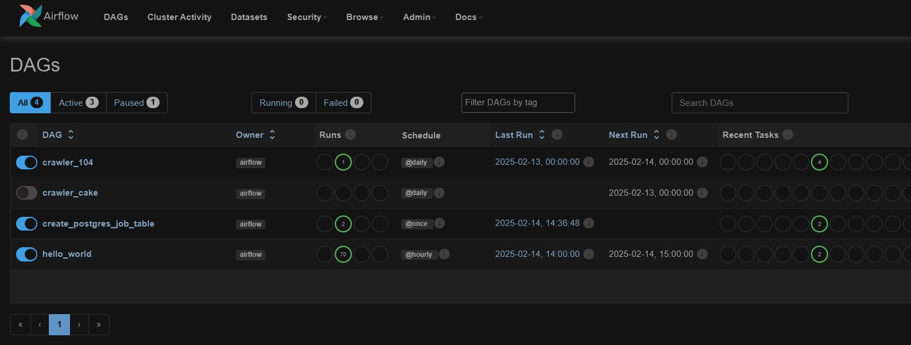
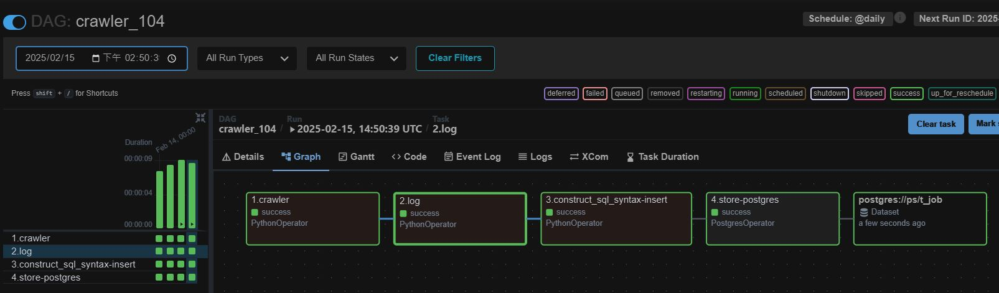
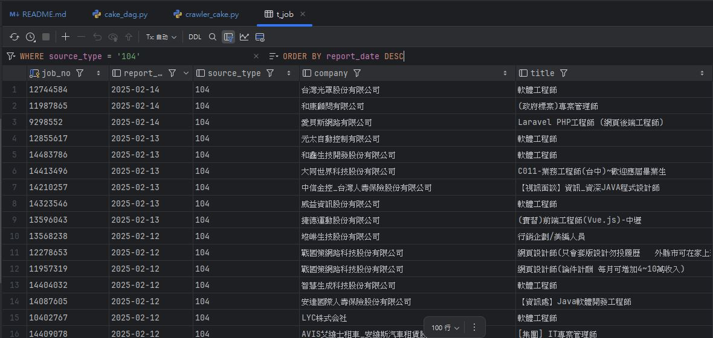

<a href='https://github.com/dl-jack-123/CAED'> <br> 
[](https://github.com/dl-jack-123/CAED) 
[](https://github.com/dl-jack-123/CAED) 
[](https://github.com/dl-jack-123/CAED) <br>
[](https://www.python.org/) 
[](https://www.microsoft.com/zh-tw/software-download/windows10) <br>
[](https://github.com/dl-jack-123/CAED) 
[](https://github.com/dl-jack-123/CAED)

<br>

# ⭐ CAED ⭐
## *A.　Current progress*
| 項目 | 內容 | 負責人 | 完成時間 |
| :--: | -- | :--: |:--:|
| 爬蟲主題方向 | 人力銀行職缺相關內容 | - | 2025-01-14 |
| 架設 Airflow 服務 | - | PC / DL | 2025-01-16 |
| 104 爬蟲實作 | 簡易版 | PC | 2025-01-26 |
| 資料表定義 | - | PC / DL | - |
| 資料庫底層撰寫 | - | DL | - |
| 資料存取設置 | - | DL | - |
| 資料表建立 | - | DL | - |
| 以 PostgreSQL 儲存資料 | - | - | - |
| 以 MongoDB 儲存資料 | - | - | - |
| Public Clouds | - | PC / DL | - |

<br>

## *B.　Summary*
- ### *a.　Crawler + Airflow + ELK Stack + Docker*
  - #### *Crawler :* 撰寫爬蟲邏輯 ( 資料抓取 / 資料驗證 )
  - #### *Airflow :* 使用其管理工作流 ( 定時排程 / 通知 /...等 )
  - #### *ELK Stack*
    - #### 部署 ELK 監控 Airflow 的任務執行情況和爬蟲日誌
    - #### 配置 Logstash，將 Airflow 和爬蟲日誌導入 Elasticsearch
    - #### 使用 Kibana 可視化日誌，方便追蹤問題與錯誤
  - #### *Docker :* 將數個服務容器化，統一管理
- ### *b.　PostgreSQL / MongoDB*
  - #### 定義資料庫規範
  - #### 測試基本的資料寫入、查詢與驗證
- ### *c.　Deployed on 3 Major Public Clouds*
  - #### Amazon Web Services
  - #### Google Cloud Platform
  - #### Microsoft Azure

<br>

## *C.　Showcase Results*
```commandline
# airflow:airflow
http://localhost:8080/
```




<br>

## *D.　Note Library*
-  ### [*⭐ Airflow Installation ⭐*](./note/installation.md)
-  ### [*⭐ Airflow Common Operations ⭐*](./note/common_operations.md)
-  ### [*⭐ Airflow Local Development ⭐*](./note/local_dev.md)
-  ### [*⭐ Airflow UI Operations ⭐*](./note/ui_operations.md)