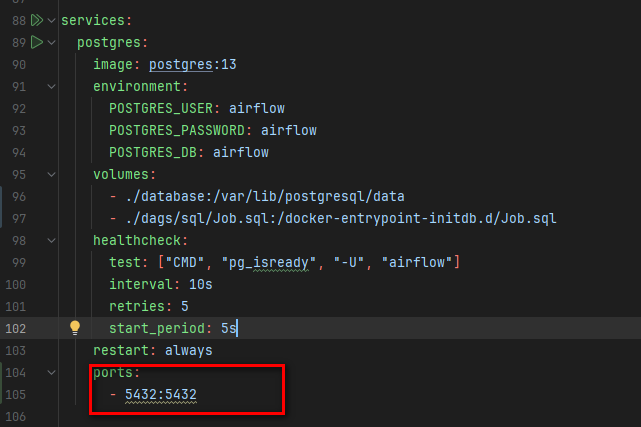
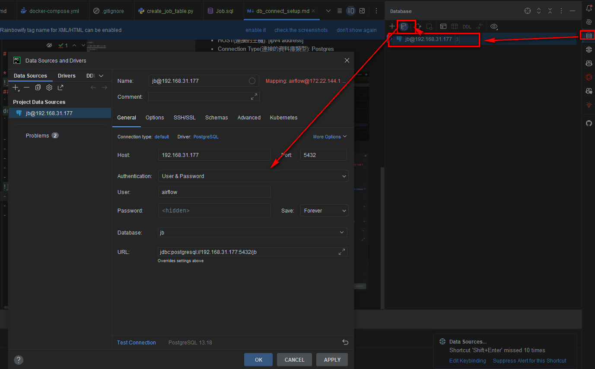
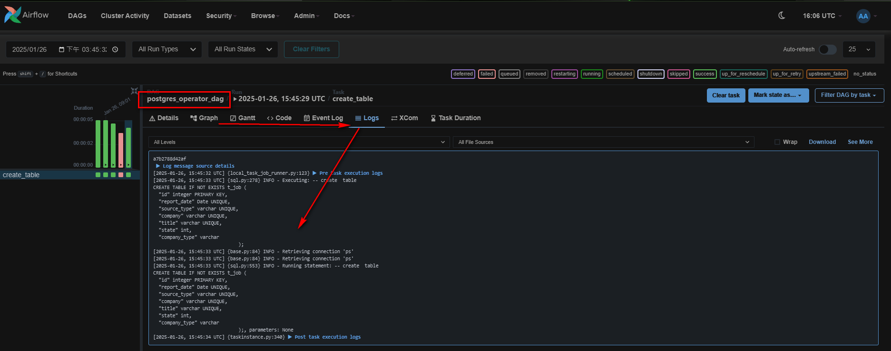

<a href='https://github.com/dl-jack-123/CAED'> 
<a href='https://github.com/dl-jack-123/CAED'> <br> 
[](https://github.com/dl-jack-123/CAED) 
[](https://github.com/dl-jack-123/CAED) 
[](https://github.com/dl-jack-123/CAED) <br>
[](https://www.python.org/) 
[](https://www.microsoft.com/zh-tw/software-download/windows10) <br>
[](https://github.com/dl-jack-123/CAED) 

<br>

## *⭐ Database Connection Setup (PostgreSQL) ⭐*

### *I.　設定連接 port，兩個 `5432`，代表 docker 容器外和容器內的 port*


<br>

### *II.　重新 Build Postgres 的服務*
```bash
docker-compose up -d --no-deps --build postgres
```

<br>

### *III.　Airflow UI 介面設定*
- Connection Id ( SQL 在 Airflow 中使用的 ID ): `ps` ( postgreSQL )
- HOST ( 連接主機IP ): `Your ipv4 address`
- Connection Type ( 連接資料庫類型 ): `Postgres`
- Database ( 連接的db名稱 ): `JB` ( 初始化建立的db )
- Login 和 Password 皆是 `airflow`
- 
- 填完後, 可從 Pycharm Data Source 設定連接
- 
- 上述設定完後到 DAG 執行 create_postgres_job_table
- 
- Done !

### *IV.　數據成功餵入 DB 後，Refresh 即可看到數據*
- 
- 
[//]: # (- ![png]&#40;../sample/db_connect_setup_6.png&#41;)
[//]: # (- ![png]&#40;../sample/db_connect_setup_7.png&#41;)

