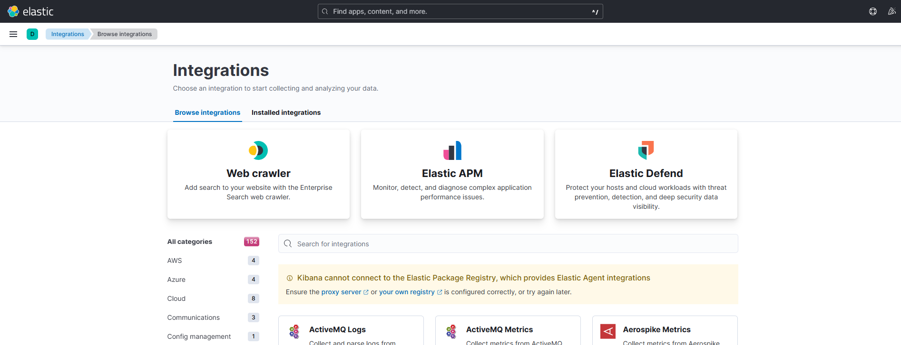

<a href='https://github.com/dl-jack-123/CAED'> 
<a href='https://github.com/dl-jack-123/CAED'> <br> 
[](https://github.com/dl-jack-123/CAED) 
[](https://github.com/dl-jack-123/CAED) 
[](https://github.com/dl-jack-123/CAED) <br>
[](https://www.python.org/) 
[](https://www.microsoft.com/zh-tw/software-download/windows10) <br>
[](https://github.com/dl-jack-123/CAED) 

<br>

## *⭐ ELK Stack ⭐*

## *I.　功能說明*
- #### ElasticSearch : 搜尋引擎
- #### Logstash : log 資料收集
- #### Kibana : 資料視覺化
- #### ELK 是一款強大的文本搜尋工具可以應用於:
  1. #### 網站搜索
  2. #### 日誌分析
  3. #### 地理空間分析處理等
  4. #### 其他

## *II.　安裝方式*
- ### *a.　進入路徑並啟動服務*
    ```bash
    cd elk; # 進入 elk 目錄
    docker-compose up -d;
    ```

- ### *b.　進入 http://127.0.0.1:5601/*
- 

- ### *c.　Airflow 設定*
  - #### 進入 Airflow 管理介面
  - #### 點選 Admin -> Connections
  - #### 點選 Create
  - #### 設定 Connection Id : elasticsearch_default
  - #### 設定 Connection Type : elasticsearch
  - #### 設定 Host : [ip]
  - #### 設定 Port : 9200
  - #### 點選 Save


## *III.　Reference*
-  ### [ElasticSearch 教學](https://gary840227.medium.com/elasticsearch-%E6%95%99%E5%AD%B8-fdbb9fdf3225)