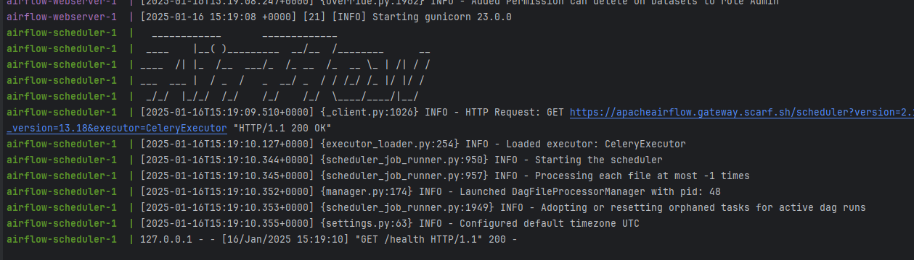

<a href='https://github.com/dl-jack-123/CAED'> 
<a href='https://github.com/dl-jack-123/CAED'> <br> 
[](https://github.com/dl-jack-123/CAED) 
[](https://github.com/dl-jack-123/CAED) 
[](https://github.com/dl-jack-123/CAED) <br>
[](https://www.python.org/) 
[](https://www.microsoft.com/zh-tw/software-download/windows10) <br>
[](https://github.com/dl-jack-123/CAED) 

<br>

## *⭐ Airflow Installation ⭐*

### *I.　建立資料夾*
```commandline
cd caed-airflow
```
```commandline
md dags; md logs; md plugins; md config; md database; md .pycharm_helpers
```

<br>

### *II.　設定變數*
- 設定 AIRFLOW_UID 
    ```bash
    echo -e "AIRFLOW_UID=$(id -u)" > .env
    ```
- 或手動建立 .env 填入
    ```bash
    AIRFLOW_UID=50000
    ```

<br>

### *III.　初始化服務*
```bash
docker compose up airflow-init -d
```

<br>

### *IV.　啟動 Python Debug 服務*
```bash
docker compose up airflow-python -d
```

<br>

### *V.　執行*
```bash
docker compose up -d
```
