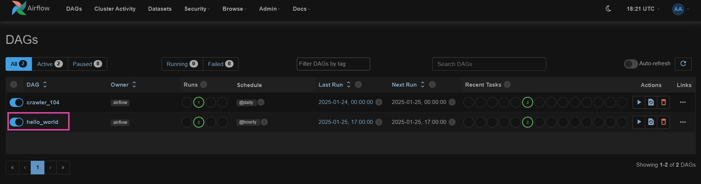
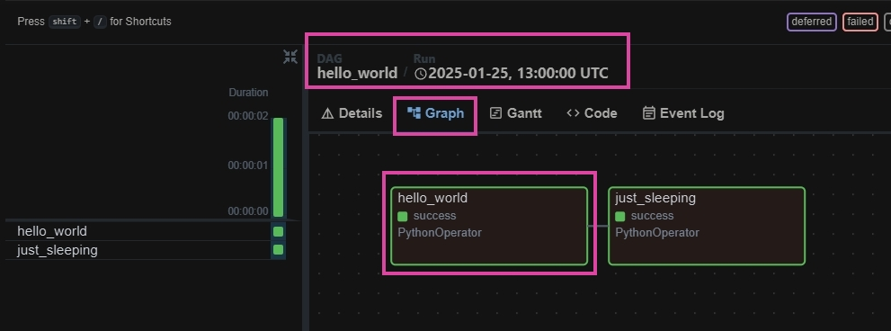
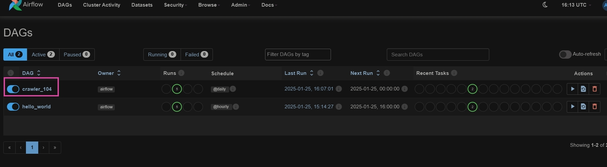
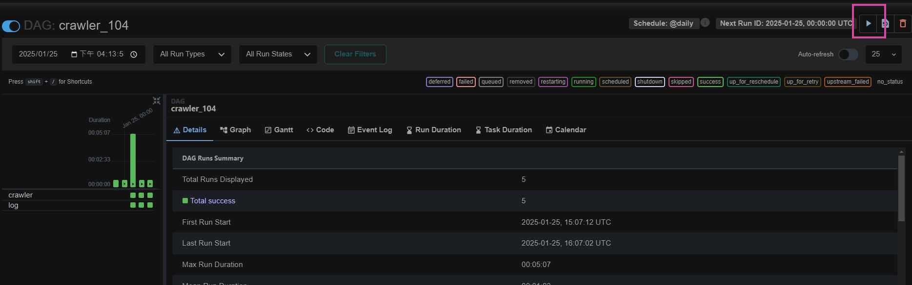
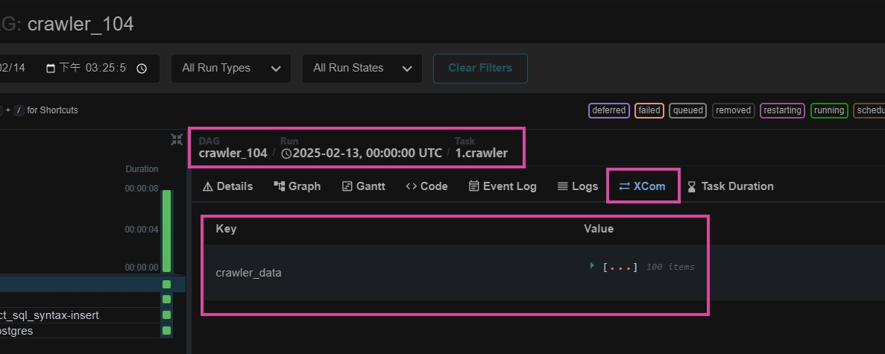

<a href='https://github.com/dl-jack-123/CAED'> 
<a href='https://github.com/dl-jack-123/CAED'>   
 
 
  
 
  
 

 

## *⭐ Airflow UI Operations ⭐*

### *I.　如何檢視 Dag 任務 log*

### *II.　如何手動啟動 Dag 任務*

### *III.　從 DAG log 中的 `XCom` 可以檢視 `流程函式` 傳遞的變數*
